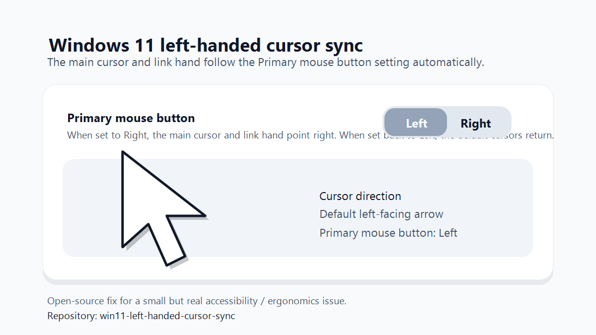

# Win11 Left-Handed Cursor Sync

Automatically flips the Windows main arrow cursor and link-hand cursor when the primary mouse button is set to `Right`, and restores the default cursors when it is set back to `Left`.

This project exists for left-handed mouse users who want the pointer direction to match the actual primary button setting.



## What problem does this solve?

Windows lets you swap the primary mouse button, but the standard arrow cursor still points the same way.

If you use your mouse left-handed, that can feel visually inconsistent:

- `Primary mouse button = Right`
- cursor still looks like the default left-pointing arrow

This project fixes that by keeping the cursor direction in sync with the setting you already use in Windows.

## What it does

- creates a horizontally mirrored copy of your current default arrow cursor;
- stores the installed files in `%LocalAppData%\MouseCursorButtonSync`;
- watches the Windows `SwapMouseButtons` setting;
- applies mirrored Arrow and Hand cursors when the primary button is `Right`;
- restores the original Arrow and Hand cursors when the primary button is `Left`;
- configures autostart for the current user;
- starts automatically when you sign in.

## What it does not do

- it does **not** replace or modify files inside `C:\Windows`;
- it does **not** require administrator rights;
- it does **not** install third-party software;
- it does **not** change every possible cursor role in Windows.

Right now, it syncs the main arrow cursor (`Arrow`) and the link-hand cursor (`Hand`).

## Requirements

- Windows 11
- Windows PowerShell 5.1 or newer
- a user account with permission to change your own `HKCU` registry settings

## Quick Start

### Option 1: Download ZIP from GitHub

1. Download this repository as a ZIP.
2. Extract it somewhere convenient.
3. Double-click `install.cmd`.

That is the easiest install path for most people.

### Option 2: Run the PowerShell installer manually

1. Download this repository as a ZIP.
2. Extract it somewhere convenient.
3. Open PowerShell in that folder.
4. Run:

```powershell
powershell.exe -NoProfile -ExecutionPolicy Bypass -File .\install-mouse-cursor-sync.ps1
```

### Option 3: Clone with Git

```powershell
git clone <repo-url>
cd win11-left-handed-cursor-sync
powershell.exe -NoProfile -ExecutionPolicy Bypass -File .\install-mouse-cursor-sync.ps1
```

If you are viewing this on GitHub, you can copy the exact clone URL from the green `Code` button.

## What happens during installation?

The installer:

1. Copies the project files to:

```text
%LocalAppData%\MouseCursorButtonSync
```

2. Detects your current non-mirrored arrow cursor.
3. Saves that original cursor path to `original-arrow-path.txt`.
4. Generates mirrored cursor files called `cursor-arrow-right.cur` and `cursor-hand-right.cur`.
5. Registers autostart for the current user using:

```text
HKCU\Software\Microsoft\Windows\CurrentVersion\Run
```

and a hidden launcher in:

```text
%AppData%\Microsoft\Windows\Start Menu\Programs\Startup
```

6. Applies the correct cursor for your current mouse-button setting.
7. Starts a small background PowerShell process that keeps the cursor in sync.

## How to use it

After installation, just change the normal Windows setting:

`Settings -> Bluetooth & devices -> Mouse -> Primary mouse button`

Behavior:

- if you select `Right`, the main cursor points to the right;
- if you select `Left`, the main cursor returns to the normal Windows arrow.

The switch is not literally instantaneous, but it should happen in about a second.

## File overview

- [install.cmd](./install.cmd): easiest install path for most users, just double-click
- [install-mouse-cursor-sync.ps1](./install-mouse-cursor-sync.ps1): installs the solution into `%LocalAppData%` and enables autostart
- [mouse-cursor-button-sync.ps1](./mouse-cursor-button-sync.ps1): background sync process for both `Arrow` and `Hand`
- [mirror-cursor.ps1](./mirror-cursor.ps1): generates a mirrored `.cur` file while preserving the hotspot
- [restore-cursor.ps1](./restore-cursor.ps1): restores the original `Arrow` and `Hand` cursors
- [uninstall.cmd](./uninstall.cmd): easiest uninstall path for most users, just double-click
- [uninstall-mouse-cursor-sync.ps1](./uninstall-mouse-cursor-sync.ps1): removes autostart and stops the sync process

## How to uninstall

Run:

```powershell
powershell.exe -NoProfile -ExecutionPolicy Bypass -File "$env:LOCALAPPDATA\MouseCursorButtonSync\uninstall-mouse-cursor-sync.ps1" -RestoreCursorForCurrentButton
```

This will:

- remove the autostart entry;
- stop the background sync process;
- re-apply the cursor that matches your current primary-button setting.

## How to restore the original default cursor manually

Run:

```powershell
powershell.exe -NoProfile -ExecutionPolicy Bypass -File "$env:LOCALAPPDATA\MouseCursorButtonSync\restore-cursor.ps1"
```

## Registry keys used

This project uses the following per-user registry keys:

- `HKCU\Control Panel\Mouse\SwapMouseButtons`
- `HKCU\Control Panel\Cursors\Arrow`
- `HKCU\Control Panel\Cursors\Hand`
- `HKCU\Software\Microsoft\Windows\CurrentVersion\Run`

## Safety notes

- This project only changes settings under `HKEY_CURRENT_USER`.
- It does not overwrite system cursor files.
- The mirrored cursors are generated from your own current Arrow and Hand cursors.
- The original cursor paths are saved so the default behavior can be restored.

## Troubleshooting

### The cursor does not change when I switch the primary mouse button

Try re-running the installer:

```powershell
powershell.exe -NoProfile -ExecutionPolicy Bypass -File .\install-mouse-cursor-sync.ps1
```

### The cursor changed once, but stopped syncing

Check whether the background process is running:

```powershell
Get-CimInstance Win32_Process -Filter "Name = 'powershell.exe'" |
  Where-Object { $_.CommandLine -match 'mouse-cursor-button-sync\.ps1' } |
  Select-Object ProcessId, CommandLine
```

If nothing is returned, run the installer again.

### I want to fully reset everything

1. Run the uninstall script.
2. Run the restore script.
3. Optionally delete:

```text
%LocalAppData%\MouseCursorButtonSync
```

## FAQ

### Will this survive a reboot?

Yes. The installer creates an autostart entry in your user profile, so it starts again when you sign in.

### Does this work system-wide for every Windows user on the PC?

No. This is installed per user, by design.

### Does this require admin rights?

No, not for the normal installation flow.

### Does this work on Windows 10 too?

It likely should, because the same cursor file format and user registry keys are used there, but this repository is focused on Windows 11 and that is the intended target.

## Shareable forum reply

A ready-to-post Microsoft Q&A / forum reply is included here:

- [docs/MICROSOFT-QA-REPLY.md](./docs/MICROSOFT-QA-REPLY.md)

## License

MIT. See [LICENSE](./LICENSE).
